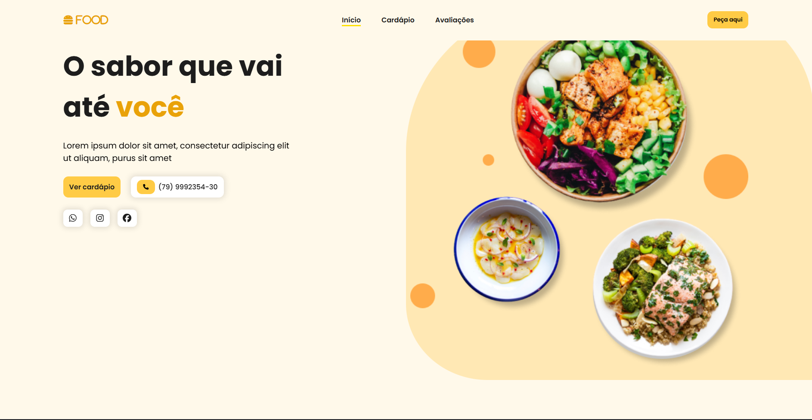
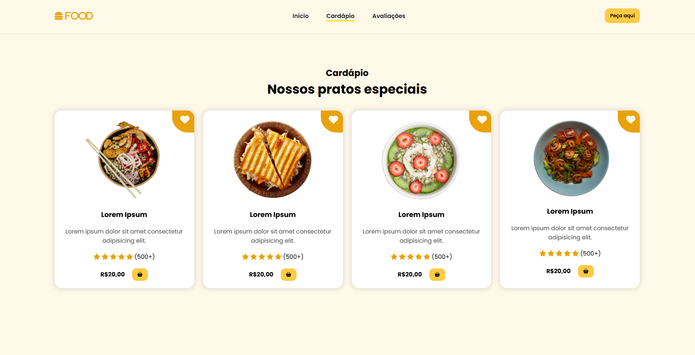

<div align="center">

# 🍔 Página de Restaurante

Uma landing page completa para restaurante, com cardápio, depoimentos e animações ao rolar a página, construída com HTML, CSS e JavaScript.


[🔗 Ver Demo](https://pagina-de-restaurante-one.vercel.app)

</div>

---

## 📌 Sobre o Projeto

Este projeto é uma landing page para o restaurante fictício, com foco em **layout comercial e experiência do usuário**, criada para praticar fundamentos de front-end: estruturação de página em seções, componentização visual (cards de prato, depoimentos), responsividade com menu mobile e animações de entrada ao rolar a página. Os textos e dados (pratos, avaliações, telefone) são placeholders de exemplo, prontos para serem substituídos por conteúdo real.

## 🖼️ Demonstração

<div align="center">

|Início | Cardápio | Avaliações |
|:---:|:---:|
|  |  | "[Avaliações](src/images/preview-avaliacoes.png) |

</div>

> 💡 Acesse a [demo ao vivo](https://pagina-de-restaurante-one.vercel.app) para navegar pela página completa.

## ✨ Funcionalidades

- 🧭 Navbar fixa com links de navegação por âncora (Início, Cardápio, Avaliações)
- 🎯 Destaque automático do link ativo no menu conforme a seção visível (scrollspy)
- 📱 Menu mobile responsivo (hambúrguer)
- 🍽️ Seção de Cardápio com cards de pratos (imagem, avaliação em estrelas, preço)
- 💬 Seção de Depoimentos de clientes
- ✨ Animações de entrada ao rolar a página (ScrollReveal)
- 📞 Botões de contato rápido (telefone e redes sociais)

## 🛠️ Tecnologias

| Tecnologia | Uso |
|---|---|
|  | Estrutura da página |
|  | Estilização e responsividade |
|  | Interações da página |
|  | Manipulação do DOM (menu mobile) |
|  | Ícones (redes sociais, estrelas, carrinho) |
|  | Animações de entrada ao rolar a página |

## 🚀 Como Executar

```bash
# Clone o repositório
git clone https://github.com/Geandysson/Pagina-de-Restaurante.git

# Acesse a pasta do projeto
cd Pagina-de-Restaurante

# Abra o index.html no navegador
# (ou use a extensão Live Server no VS Code)
```

Não há dependências para instalar é um projeto 100% front-end estático (Font Awesome, jQuery e ScrollReveal são carregados via CDN).

## 📂 Estrutura do Projeto

```
Pagina-de-Restaurante/
├── src/
│   ├── style/
│   │   └── style.css        # Estilização e responsividade
│   ├── images/                # Imagens dos pratos, banner, depoimentos e ícone
│   └── javascript/
│       └── script.js          # Lógica do menu mobile e interações
├── index.html                  # Estrutura principal da página
```

## 🎯 Aprendizados

- Estruturação de landing page em seções semânticas (`header`, `main`, `section`, `footer`)
- Criação de menu mobile responsivo com toggle via JavaScript/jQuery
- Implementação de scrollspy (destaque de seção ativa) com base na posição de rolagem
- Integração de bibliotecas externas (Font Awesome, jQuery, ScrollReveal) via CDN
- Construção de componentes reutilizáveis (cards de prato, cards de depoimento)
- Organização de projeto front-end com separação de estilos, imagens e scripts

## 👤 Autor

**Geandysson**

[](https://github.com/Geandysson)

---